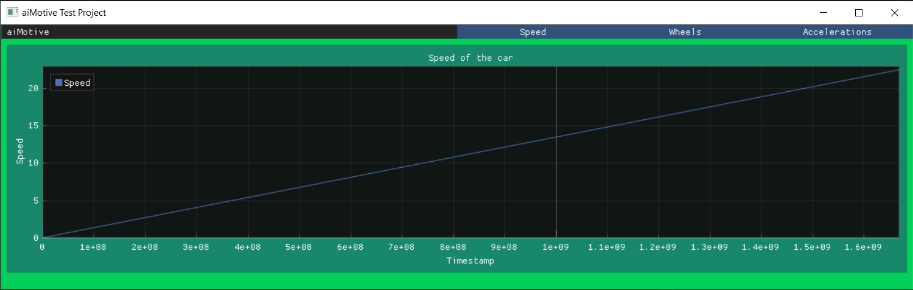
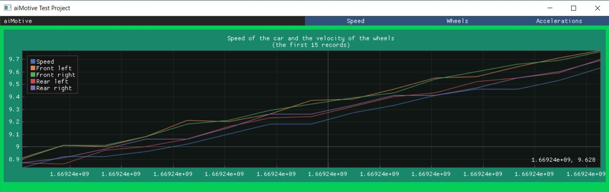
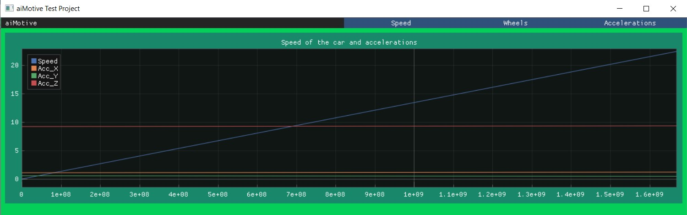

# aiMotive Test Project

This is my solution for the test project.

## Task 1

It is simple to run. Just clone my repo and there is the `task1` folder with the `task1.cpp` file, and also there is the `data` folder for my programs that work with the CSV files. To run it, compile with `g++` from the root of the `aiMotive` directory:

```shell
g++ task1/task1.cpp data/*.cpp
```

Then run the executable file. Basically, it is just a console application with some text where you can find information about my answers to the questions, but I want the complete it right here.

### a.
We can encounter various errors in a given database. Firstly, we can consider it an error when we encounter missing data. Furthermore, the measuring instrument can also make errors and possibly transmit false values to us. These values are primarily problematic when they are outliers. So if we come across such data, it may be worth filtering them out or examining what might have happened. There are several methods for this, like the Kalman filter.

Another error can occur when we cannot identify a specific measurement, such as when it occurred. For example, at the end of the dbw.csv file, there are data rows without timestamps. While we can infer when these measurements were taken, it is important for us to receive precise information at all times. In the program, I tracked these records without the timestamp data.

### b.
More precisely, we could only provide an exact answer to this with the help or utilization of timestamp values. However, if we needed to find another solution for this, perhaps we could infer from the other values. For instance, if we examine the car's velocity and acceleration on the x-axis, then if every time the sensor measures acceleration (meaning the acceleration is positive), the velocity should also increase. Under such conditions, if this holds true everywhere, we can say that the two measurements likely occurred simultaneously, but we cannot be certain. However, if this condition does not hold, it does not rule out the overlap of the data. Another, more accurate solution could involve examining the yaw rate since it should roughly correspond to gyro_z since they measure the same data.

### c.
From the sensors, we can obtain more accurate values in two ways. One method is to have the sensor transmit data more frequently. This is beneficial because it provides a more precise representation of the measured property. The other method is to work with more accurate values to detect even the slightest changes. This can be observed in our dataset, where there is a section where the device can provide values with precision down to 20 decimal places for both angular rotation and acceleration, while we also have data with a precision of only 2 decimal places. So, during the examined period, the acceleration and gyro signals are not of the same quality. One of the simplest methods to assess the data quality is to look at the precision of the numbers we are working with and visualize this data. It becomes evident in which section the values are much more reliable.

## Task 2
Basically, I used the Dear ImGui library with the ImPlot extension, which was very useful.

In this task, I created an app where you can view 3 plots based on the CSV files that I got. The first one is a simple one about the time and the speed of our car.



For the second one, I used the dbw.csv file. Here, you can track the car's speed and the velocity of all the wheels. It shows only the first 15 records from our database because you can see the differences more easily.



In the last one, there are the car's accelerations compared with the speed.



Backend and Renderer: Win32 and DirectX 11

### Usage
To run this app, you have to make some modifications to my repo, for which I am truly sorry, but I couldn't make it easier.

1. Clone my repo.
2. Go to aiMotive\task2\DataPlot\DataPlot\vendor.
3. Remove the empty imgui folder.
4. Clone the Dear ImGui repo to this vendor folder.
5. Download the ImPlot files for your computer.
6. From the ImPlot directory, move 5 (.cpp and .h) files here (aiMotive\task2\DataPlot\DataPlot\vendor\imgui).
7. Now you can view and run my application by opening the project in Visual Studio.
